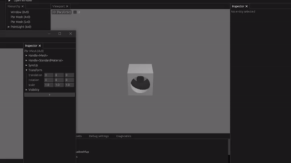

# bevy_sync

Plugin for synchronizing entities and components between server and its clients. This plugin is meant to support collaborative editing environment through editors and supports bi-directional updates between server and client.

Uses `bevy_renet`.

Current state is in development.

- [X] Entity synchronization
- [X] Component synchronization
- [X] Parent/Child entity synchronization
- [ ] Skippable channel for Unordered+Unreliable
  - [ ] Transform
- [ ] Throttleable sync (time window queuing)
- [ ] Host switch / promotion
- [X] SimpleMaterial (through sync channel)
- [X] Refactor asset transfer through http
- [X] Asset: Mesh
  - [X] programmatically created mesh
  - [X] mesh from gltf: static
  - [ ] rigged
  - [ ] with morphs
- [X] Asset: Textures
- [ ] Asset: Audio
- [X] Compressed Assets

**Asset are synchronized only if they are added to bevy by uuid.**

## Examples

Run both examples so the they connect to each other:

- `cargo run --example host`
- `cargo run --example client`

Then open the editor and change a component value in one to see it reflected in the other.

## Versions

Base version of bevy_sync is inherited from bevy version.

| bevy | bevy_sync |
| ---- | --------- |
| 0.12 | 0.12.x    |

